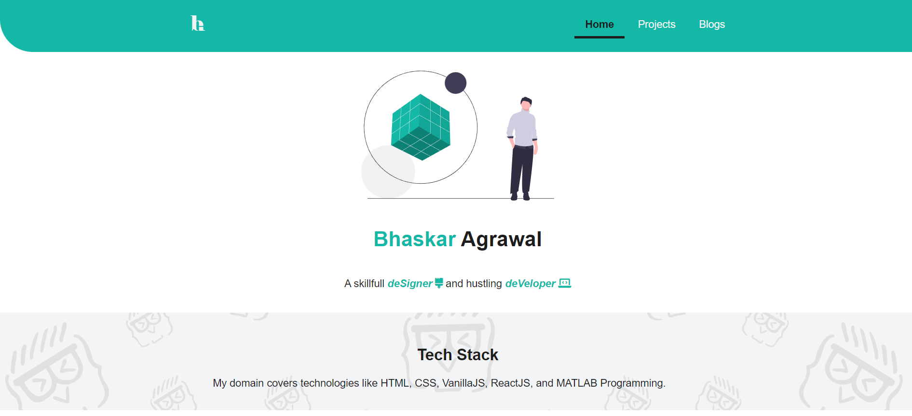
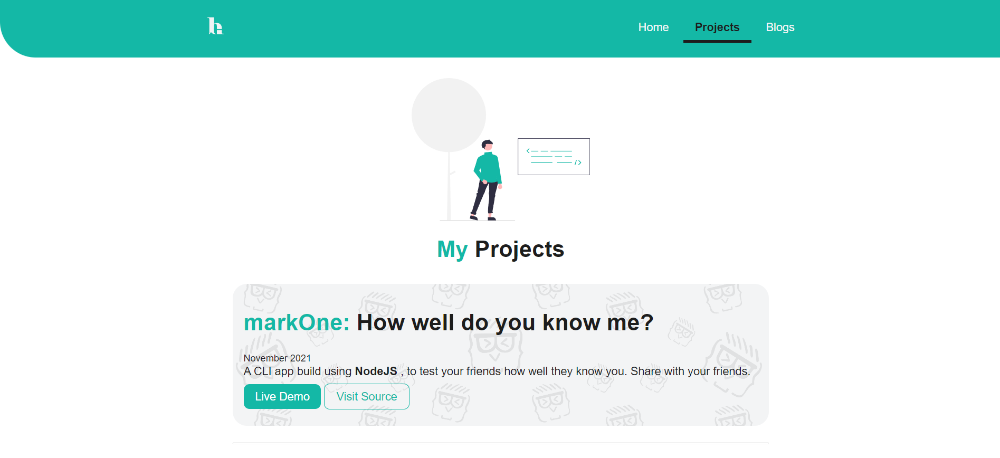

# My Level-0 Portfolio

This is my personal portfolio
started on 30-11-2021.
Hope to develop soon and become a good developer.

>The projects developed cover the following tech-stack
* VanillaJS
* HTML
* CSS
* ReactJS

In this website, you can browse through my projects developed in process of learning Level-0 path guided by [Tanay Pratap](https://twitter.com/tanaypratap) Bhaiya.

Here are a few project-related insight pictures:

1. The Landing Page 

2. The Project Section

3. The Blogs Section

If you liked the [portfolio](https://tp-lesson-3-ba.netlify.app/), let's connect !

 &emsp;&emsp;
    
    
    

